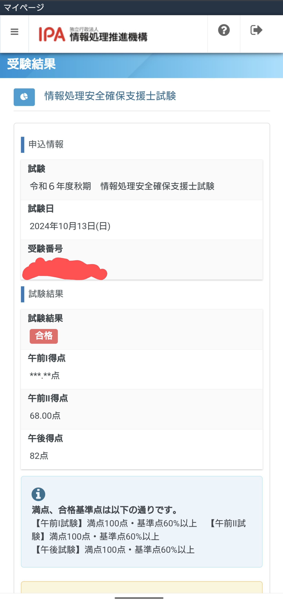

令和６年度秋の<Marker>情報処理安全確保支援士</Marker>に合格しました。 

すでに２回落ちており、３回目の挑戦でした。。。

{/* <!--more--> */}

<Toc>
- 午前 I、II 点数/午後点数
- 午後自己採点との差
- 午後選択問題
- どれぐらい勉強した？
- 勉強方法
- 感想
</Toc>

### 午前 I、II 点数/午後点数

応用情報技術者試験に合格してから２年以内だったため、午前 Ⅰ は免除となりました。

- 午前 I: 免除
- 午前 II: 68 点
- 午後: 82 点

### 午後自己採点との差

<Bold color="red">あり（＋ 17 点）</Bold>

試験後、TAC 様が公表されていた模範解答速報で自己採点を行いました。 
自分の解答とかなり違っており、ちょっと落ち込みました。 
しかしいざ蓋を開けてみると、なぜか自己採点時より得点が上がっており、不思議に思いました。

### 午後選択問題

下記を選択しました。 
試験一年前に話題になったセキュリティの話が問題として出題されやすいと聞きましたが、 
実際に DMARC の問題が当日出題されていました。しかし、内容が難しくスキップしました。

1. <Marker color="blue">インシデントレスポンス</Marker>
2. <Marker color="blue">クレジットカード情報の漏洩</Marker>

### どれぐらい勉強した？

2 回落ちて、3 回目受験時点で累計 3 ヶ月くらいでした。 
1 日 1-2 時間程度

### 勉強方法

午前 2 は情報処理安全確保支援士ドットコムの過去問道場でひたすら問題を解きました。 
午後対策としては、下記のテキストを使用しました。

- 上原本（2 周）
- 村山本（2 周）
- (つまみ食いで)重点対策
- 過去問 3 年間分くらい

<BlockLink href="https://amzn.asia/d/gfVILYN">
  情報処理教科書 情報処理安全確保支援士 2025年版
</BlockLink>

### 感想

たまたま 2 問とも普段の業務内容に近い問題だったので、なんとか合格できた印象です。 
自分の回答内容が IPA の模範回答とも結構違ったので、大問 1 の記述が壊滅的だと思ったら点数があったのでよかったです。

<Note>
情報処理安全確保支援士は情報セキュリティのスペシャリスト向けの国家資格です。合格後は登録を行うことで「登録セキスペ」として活動できます。
</Note>
